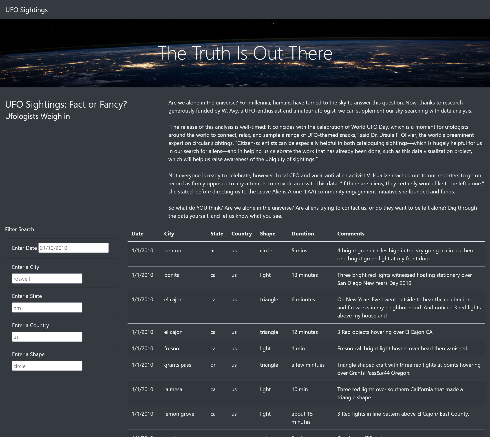
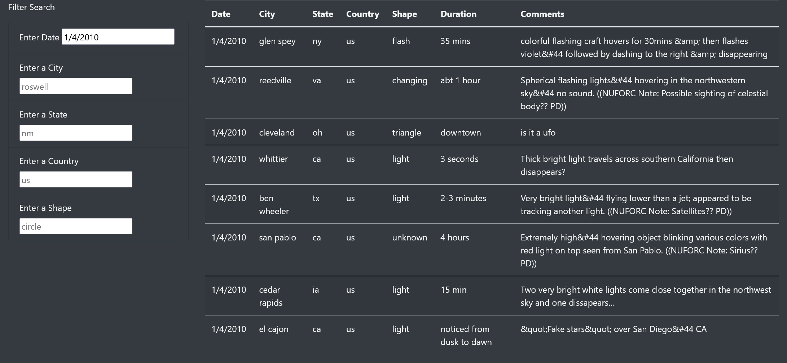
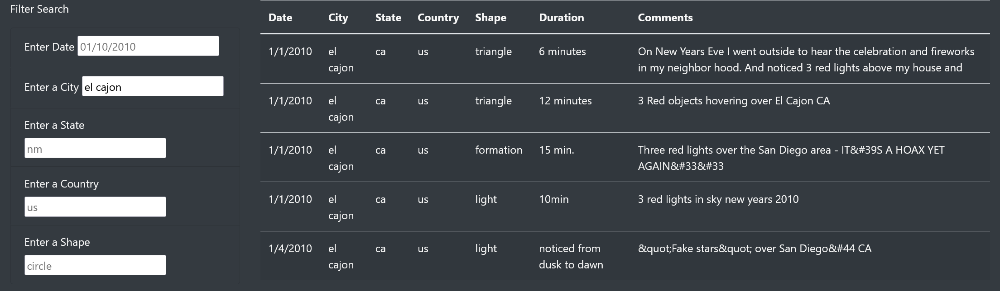
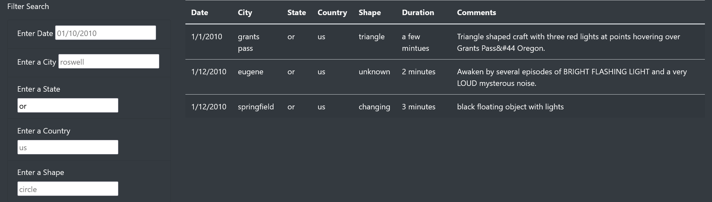
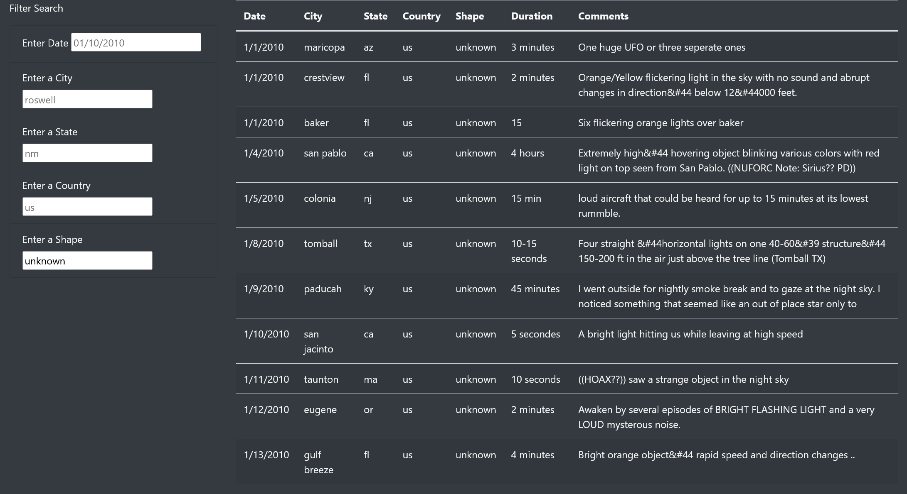
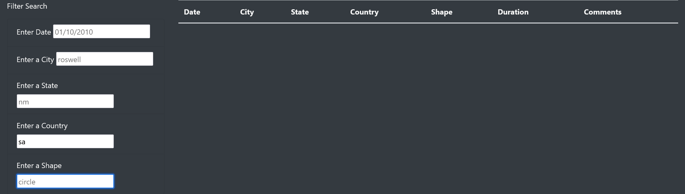
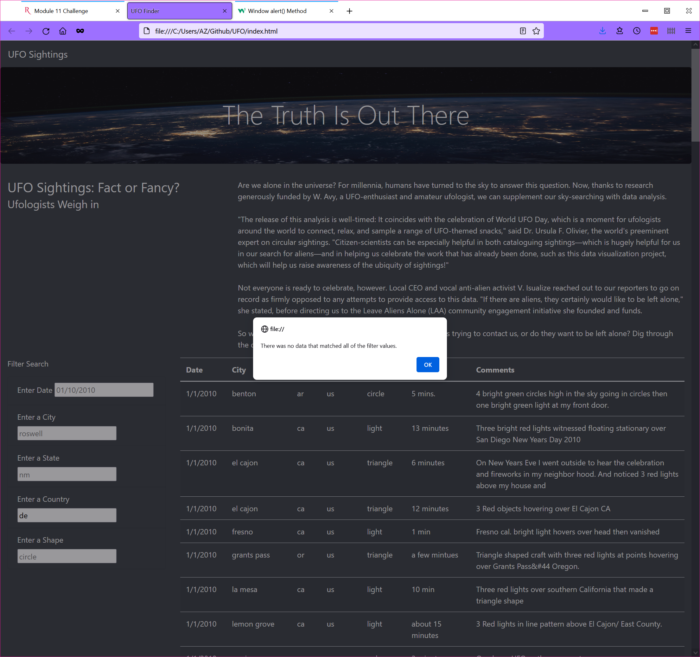

# UFO Finder website with Javascript

## Overview
This project developed javascript-based filtering of UFO sighting data.  An initial website was created with date filtering of the sighting data.  This trial demonstrated the a great improvement in the user experience within the site, so it was decided to expand the filtering to cover additional criteria.

## Technology
This project included the following technologies:
* Javascript - The programming language that enables the interactive elements of the website.  This included the logic to detect user input and filter the data for display.
* HTML - The web presentation technology.

	
## Filtering the UFO Sighting Data
Upon entering the web site, the user is presented with a table of sighting data and five text-based filter fields:
* Date
* City
* State
* Country
* Shape

The user is free to enter any type of input into the fields, but "placeholder" values are always displayed to help guide the user input. 

 The "filter" is applied as soon as any field contents are changed and the focus is moved into another field. For any changes to the filter field, a Javascript event handler responds to the updated field value, filters the data according to the field values, and refreshes the table of sighting data. 

Below are images of example filtering with the corresponding data displayed:

### Date Filter
Entering a date value will filter the displayed data for the desired date.

### City Filter
Entering a city name will filter the displayed data for the desired city.

### State Filter
Entering a state abbreviation will filter the displayed data for the desired state.

### Shape Filter
Entering a shape value will filter the displayed data for the desired UFO shape.

## Combined Filters
The user is able to refine the displayed data by placing filter criteria in multiple fields - refining the displayed data as each criterion is entered.

### Examples
The following example shows a combination filter that utilizes the Date and State filter fields simultaneously.

The next example shows a combination filter that utilizes the State and Shape filter fields simultaneously.

## Summary
This new design is powerful and enables the user to quickly locate the information they desire.  However, it is also very easy for the user to filter out all of the available data, so that the table is emptied without warning.  This is a serious drawback.

### Recommendations
One possible remediation is to display an alert when the user enters filter values that exclude all the available data.  This explanation allows them to understand the cause for the situation and to change their filtering accordingly.

This remediation is easy and quick to implement, but is purely reactive.  It is likely that users will encounter this frequently.

The best approach would be to include input validation to guide the user as they entered filter values, so they filter within the available data.  This is a proactive approach that makes the site more user friendly, while still allowing flexible viewing of the data.
